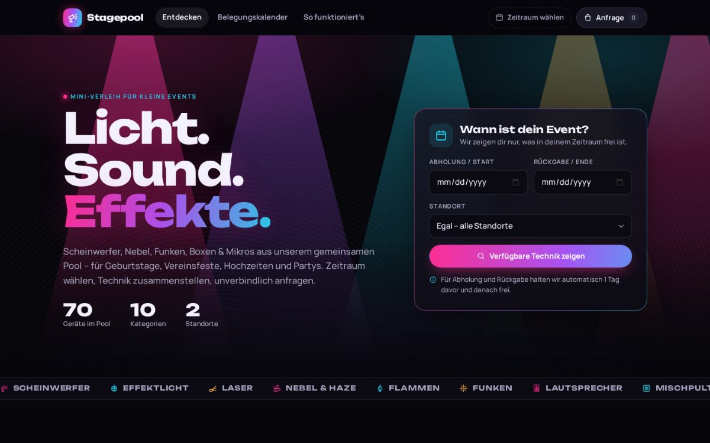
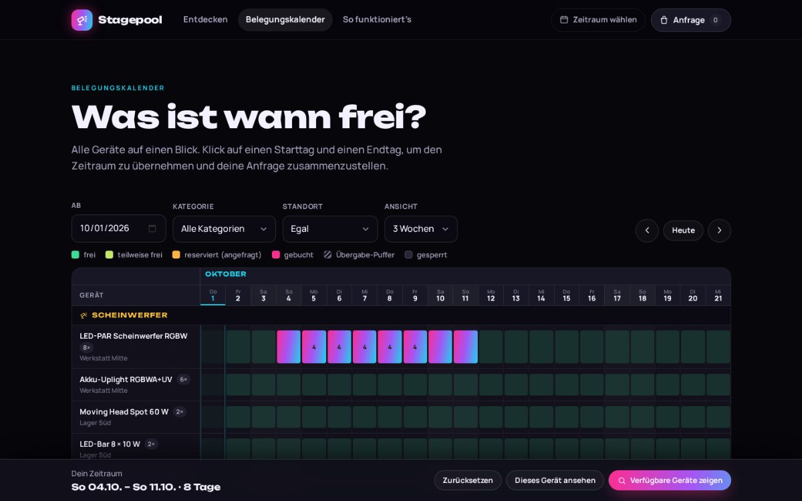
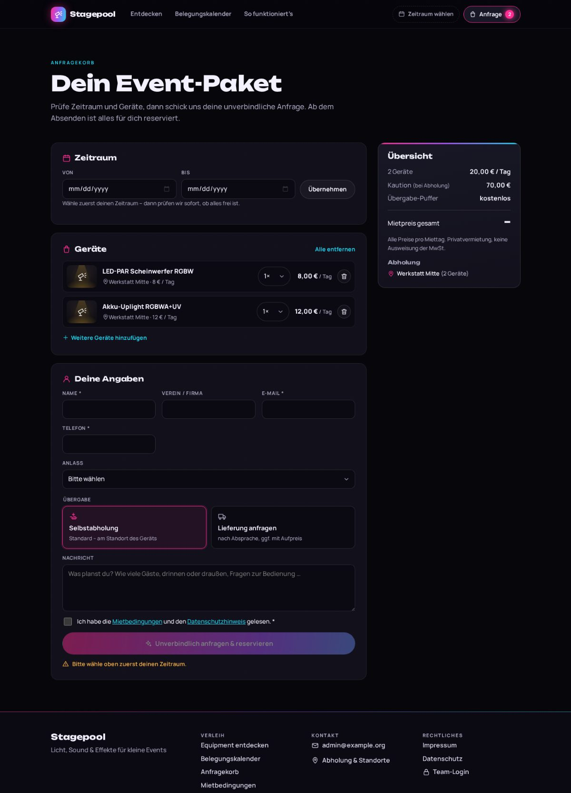
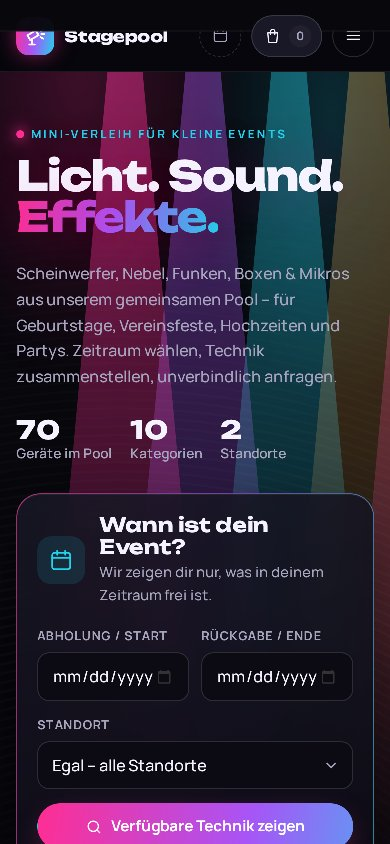
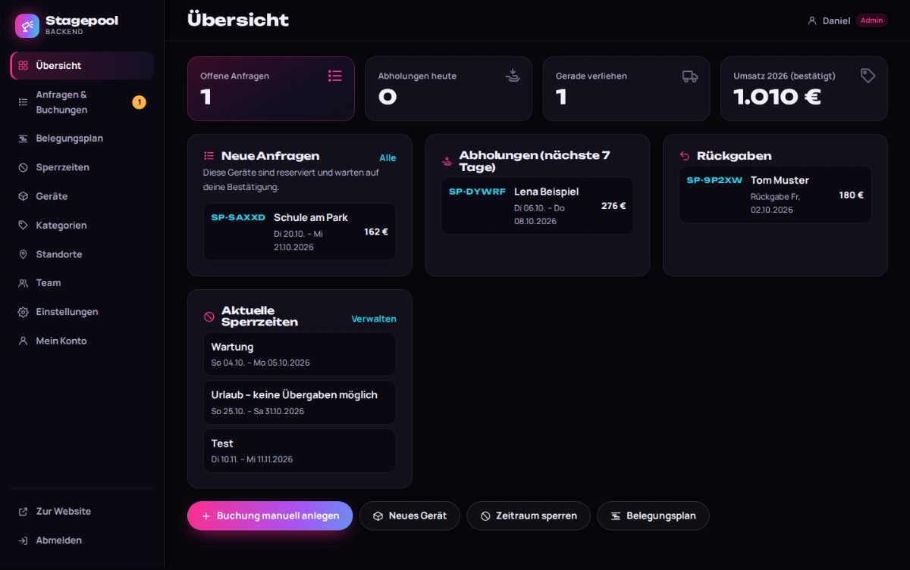
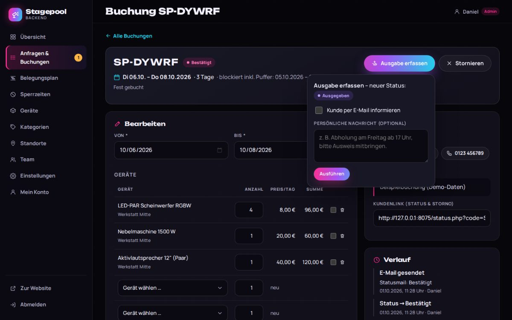
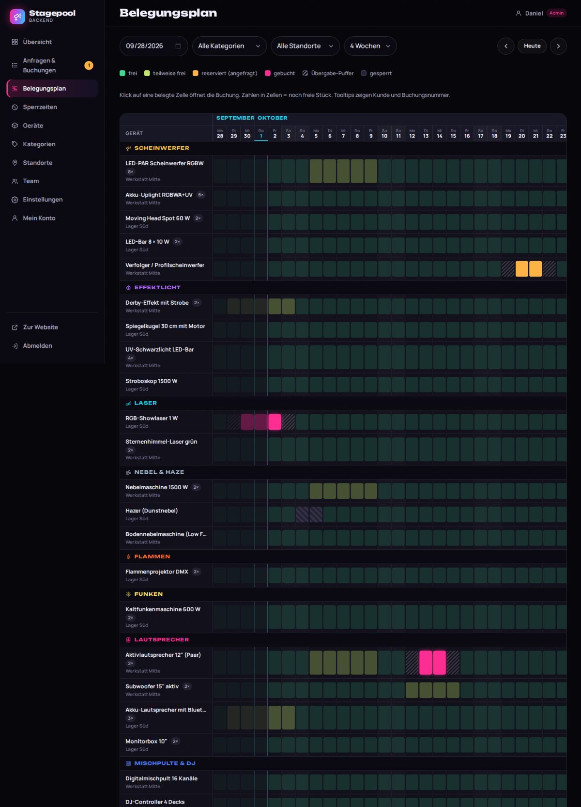
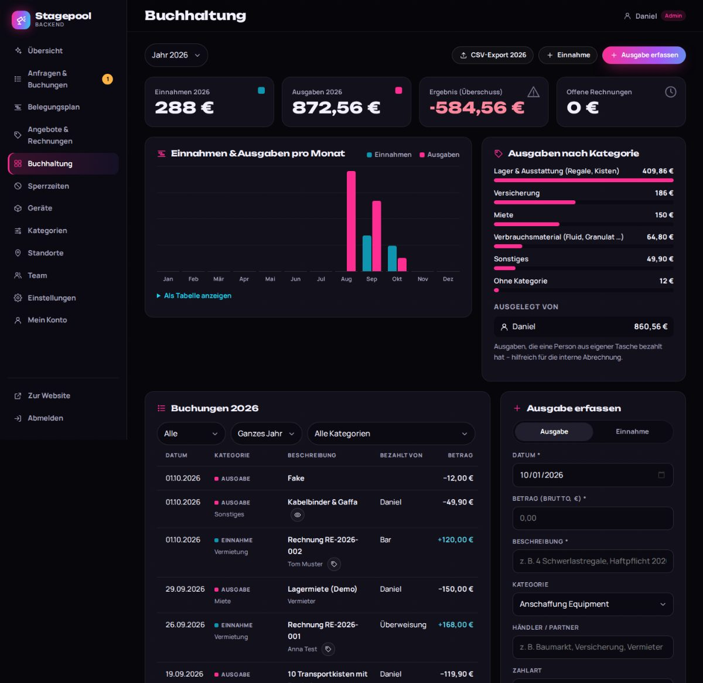
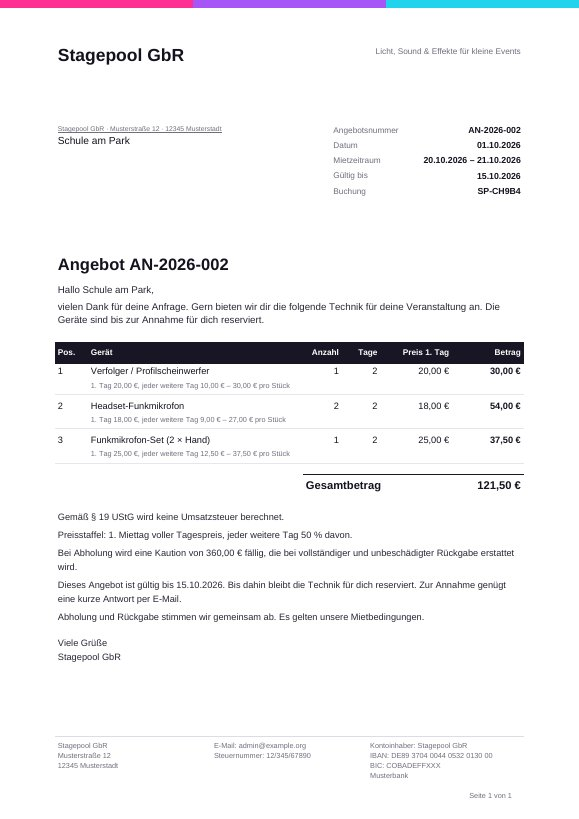
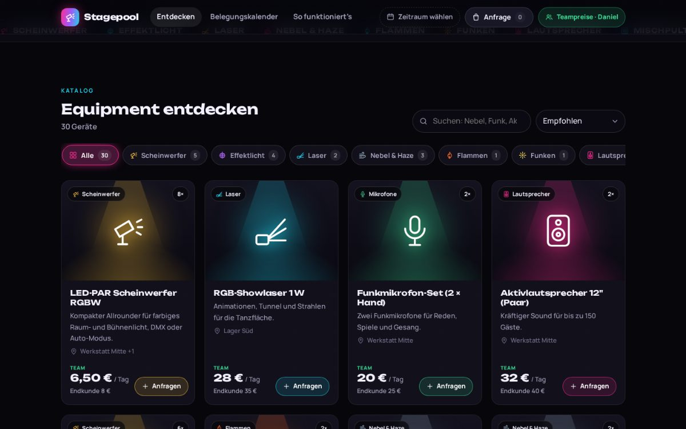

# 🎛️ Stagepool – Mini-Verleih für Event-Technik

Web-Plattform, über die ihr euer gemeinsames Event-Equipment (Scheinwerfer, Nebel, Flammen, Funken, Boxen, Mischpulte, Mikrofone, Laser …) an Leute verleiht, die **kleine Veranstaltungen** planen.

**Technik:** PHP 7.3+ (getestet mit PHP 7.3.33 und 8.3), MySQL/MariaDB **oder** SQLite, keine Frameworks, kein Composer, kein Build-Schritt. Läuft auf jedem normalen Webhosting-Paket.

> Der Name „Stagepool“ ist ein Arbeitstitel und lässt sich im Backend unter *Einstellungen → Allgemein* ändern.



| Belegungskalender | Anfragekorb | Mobil |
|---|---|---|
|  |  |  |

| Backend: Übersicht | Backend: Buchung bestätigen | Backend: Belegungsplan |
|---|---|---|
|  |  |  |

| Backend: Buchhaltung | Angebot als PDF |
|---|---|
|  |  |

| Als Team eingeloggt: Teampreise mit Endkundenpreis zum Vergleich |
|---|
|  |

## Funktionen

**Für Besucher**
- Katalog mit Kategorie-Chips, Suche, Sortierung und Standort-Filter
- **Zeitraum-Filter:** Von/Bis eingeben, dann zeigt der Katalog nur Geräte, die im ganzen Zeitraum frei sind
- Automatischer **Puffertag** vor und nach jeder Buchung für Abholung und Rückgabe (einstellbar)
- Geräte mit mehreren Exemplaren (z. B. 8 PAR-Scheinwerfer) mit Anzeige „x von y frei“
- Produktseite mit Verfügbarkeitskalender (zwei Klicks = Zeitraum wählen) und Live-Preisberechnung
- **Belegungskalender** (Geräte × Tage) zum Stöbern, wann was frei ist
- **Staffelpreise:** 1. Miettag voller Preis, jeder weitere Tag nur 50 % (einstellbar) – z. B. 100 € / 150 € / 200 € für 1 / 2 / 3 Tage
- **Anfragekorb:** Zeitraum + Geräte, automatisch berechnete Summe, Kaution, Abholstandorte
- **Teampreise:** Eingeloggte Teammitglieder sehen und mieten zum internen Preis (Endkundenpreis zum Vergleich) – z. B. wenn sie für eigene Kunden Technik zusammenstellen
- Anfrage = **Reservierung**: Die Geräte sind ab dem Absenden für andere blockiert
- Bestätigungs-E-Mail mit persönlichem Status-Link (inkl. Selbst-Storno)

**Für euch (Backend, passwortgeschützt)**
- Dashboard: offene Anfragen, anstehende Abholungen, Rückgaben (inkl. „überfällig“)
- Buchungs-Workflow: **Angefragt → Angebot gesendet → Bestätigt → Ausgegeben → Zurückgegeben** (oder Abgelehnt/Storniert), wahlweise mit E-Mail an den Kunden
- **Angebote & Rechnungen als PDF:** per Klick erstellen, als PDF herunterladen und/oder per E-Mail (PDF im Anhang) verschicken; fortlaufende Rechnungsnummern, Zahlungseingang erfassen, Kunde kann Belege über seinen Status-Link abrufen
- **Buchhaltung:** Einnahmen & Ausgaben (Miete, Anschaffungen, Regale/Kisten, Versicherung …) mit Beleg-Upload, „ausgelegt von“ pro Person, Jahres- und Monatsübersicht, CSV-Export für die Steuer; bezahlte Rechnungen werden automatisch als Einnahme verbucht
- Buchungen bearbeiten oder manuell anlegen (z. B. Telefonanfragen), mit Konfliktprüfung und Preisanpassung (Rabatt/Pauschale)
- **Sperrzeiten:** einzelnes Gerät, ganzer Standort (z. B. Urlaub) oder alles
- Belegungsplan mit Buchungsnummern, Geräte (mit Foto-Upload), Kategorien, Standorte
- **Bestand je Eigentümer & Standort:** gleiche Geräte mehrerer Personen/Standorte als ein Gerät; automatische Zuteilung, wessen Exemplare rausgehen (änderbar), Standort-Sperren betreffen nur die Exemplare dort, Mietumsatz pro Eigentümer
- **Zwei Preislisten:** interner Teampreis und Endkundenpreis (fest oder automatisch intern + X %)
- Team-Zugänge für alle, die Material einbringen (Besitzer pro Gerät), Rollen Team/Admin
- Einstellungen: Texte, Regeln (Puffer, Vorlauf, Min./Max.-Dauer), Impressum/Datenschutz, E-Mail-Versand (mail() oder SMTP)

**Sicherheit & Datenschutz:** CSRF-Schutz, Passwort-Hashing, Login-Sperre nach Fehlversuchen, Prepared Statements, Upload-Prüfung, geschützte Ordner per `.htaccess`, Spam-Schutz (Honeypot + Zeitprüfung), Schriften lokal eingebunden (keine Google-Fonts-Anfragen), kein Tracking.

## Schnellstart

**Fertiges Upload-Paket:** [`dist/stagepool-1.2.0.zip`](dist/stagepool-1.2.0.zip) (neu bauen mit `./build-zip.sh`)

1. ZIP entpacken und den Inhalt per FTP auf den Webspace laden
2. `https://eure-domain.de/install/` aufrufen und den Assistenten ausfüllen
3. Im Backend (`/admin/`) anmelden und Einstellungen, Standorte und Geräte pflegen

Die ausführliche Anleitung steht in **[docs/INSTALLATION.md](docs/INSTALLATION.md)**.

## Dokumentation

| Dokument | Inhalt |
|---|---|
| [docs/INSTALLATION.md](docs/INSTALLATION.md) | Hosting-Anforderungen, Upload, Installation, E-Mail, HTTPS, Backup, Updates, Fehlerhilfe |
| [docs/HANDBUCH.md](docs/HANDBUCH.md) | Bedienung des Backends für das Team |
| [docs/KONZEPT.md](docs/KONZEPT.md) | Ablauf, Buchungsstatus, Verfügbarkeitslogik, Datenmodell, Design |

## Ordnerstruktur

```
stagepool/
├── index.php, produkt.php, kalender.php,     öffentliche Seiten
│   warenkorb.php, status.php, danke.php,
│   info.php, impressum.php, datenschutz.php
├── admin/          Backend (Login, Buchungen, Geräte, Sperrzeiten …)
├── install/        Installations-Assistent (nach der Installation gesperrt)
├── inc/            PHP-Logik (geschützt)
├── config/         config.php mit Zugangsdaten (geschützt, wird erzeugt)
├── storage/        Logs, SQLite-Datenbank, Buchhaltungsbelege (geschützt)
├── uploads/        Gerätefotos (PHP-Ausführung gesperrt)
├── assets/         CSS, JavaScript, Schriften, Icons
└── docs/           Dokumentation
```

## Lizenzen

PDF-Erzeugung: [FPDF](http://www.fpdf.org/) (freie Lizenz, siehe `inc/lib/fpdf/LICENSE.txt`). Schriften: [Unbounded](https://github.com/googlefonts/unbounded) und [Manrope](https://github.com/sharanda/manrope), beide SIL Open Font License 1.1 (siehe `assets/fonts/`). Icons: eigene Zeichnungen.
